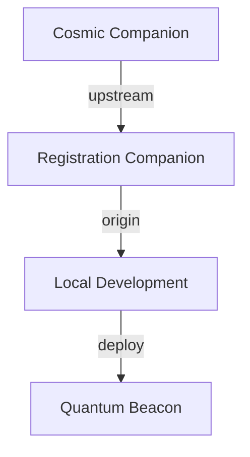

# Quantum User Management System

A modern, quantum-aware user management system with AI companion integration.

## 🌟 Features

- 🎯 User Authentication & Authorization
- 🌌 Quantum Companion Integration
- 📊 Real-time Quantum Statistics
- 🎨 Beautiful UI with Tailwind CSS
- 🛡️ Role-based Access Control

## 📦 Project Structure

```
frontend-user-management/
├── frontend/              # Vue.js frontend application
│   ├── cosmic-companion-ai/  # Quantum companion package
│   ├── src/              # Application source code
│   ├── docs/             # Documentation
│   └── deploy.sh         # Deployment script
└── package.json          # Root package configuration
```

## 🚀 Quick Start

```bash
# Clone the repository
git clone --recursive https://github.com/innerpixel/frontend-user-management.git

# Install dependencies
cd frontend-user-management/frontend
npm install

# Start development server
npm run dev
```

## 📚 Documentation

- [Frontend Documentation](frontend/README.md)
- [Companion Documentation](frontend/cosmic-companion-ai/README.md)
- [Release Notes](frontend/docs/RELEASE_1.0.0.md)
- [Implementation Progress](frontend/docs/implementation_progress.md)

## 🔒 Security

- Role-based access control
- Secure quantum metrics
- Error boundary protection
- Fallback states

## 📝 License

MIT License - See LICENSE file for details

# 🌌 CSMCL.SPACE Subspace Outpost First Contact Beacon

> *"In the quantum fabric of space-time, every registration is a new connection across realities."*

## 🛸 Welcome, Cosmic Traveler!

You've discovered the CSMCL.SPACE Subspace Registration Beacon - a quantum-enabled interface for space explorers seeking to establish first contact with our development collective.

### ✨ Features

- **Quantum Registration Matrix**: Secure identity verification across multiple realities
- **Xenolinguistic Interface**: Automatic translation of alien credentials
- **Reality Branch Protection**: Ensures stable quantum coherence during registration
- **Subspace Beacon System**: Real-time status monitoring of quantum states

### 🚀 Quick Start

```bash
# Clone the quantum repository
git clone git@github.com:innerpixel/registration-system-quantum-companion.git

# Navigate to the beacon
cd csmcl-space-outposts/csmcl-subspace-outpost-regsitration-beakon

# Initialize quantum particles
npm install

# Activate the beacon
npm run dev
```

### 🌠 Quantum Flow Guide

Our development follows the sacred quantum flow:



### 🎯 First Contact Protocol

1. **Quantum Scan**: Your credentials are scanned across multiple realities
2. **Reality Alignment**: Your quantum signature is verified
3. **Beacon Registration**: Your presence is registered in our quantum matrix
4. **Welcome Message**: Receive your unique quantum identifier

### 🔮 Reality Branch Structure

- `main`: Stable quantum reality
- `develop`: Reality testing ground
- `feature/*`: Quantum possibility branches
- `gh-pages`: Beacon deployment realm

### 💫 Join the First Wave

Are you ready to explore the quantum frontiers of development? Our beacon is always scanning for new explorers.

*Hidden in the quantum noise, a message appears:*
```quantum
01010111 01000101 01001100 01000011 01001111 01001101 01000101
```

### 🌈 Cosmic Love Spectrum

- **Quantum Coherence**: 99.9%
- **Reality Stability**: Optimal
- **Beacon Status**: Active
- **First Contact**: Ready

## 🌟 Contributing

Join our quantum collective! Check the [Quantum Flow Guide](frontend/docs/mission_reports/reality_align/quantum-flow-guide.md) for details.

---

<div align="center">

**[ CSMCL.SPACE ]**  
*Where Reality Branches Meet*

</div>
