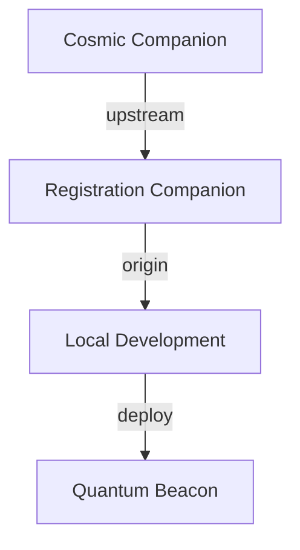

<<<<<<< HEAD
# Cosmic Companion AI

An ethereal AI companion component for space-themed Vue applications. This component provides an interactive, luminous AI assistant that helps users navigate quantum realities and interact with your space application.

## Features

- **Quantum Reality Integration**
  - Reality branch navigation
  - Coherence level monitoring
  - Achievement tracking

- **Ethereal UI Design**
  - Luminous, transparent interfaces
  - Radial gradients and glowing effects
  - Smooth animations and transitions

- **Interactive Tutorial System**
  - Guided quantum tours
  - Reality branch exploration
  - Achievement unlocks

- **Advanced Styling**
  - Tailwind integration
  - Custom CSS effects
  - Responsive design

## Installation

```bash
# Install from GitHub
npm install git+https://github.com/innerpixel/cosmic-companion-ai.git

# Or install locally
npm install --save file:./cosmic-companion-ai
```

## Usage

1. Register the plugin in your main.js:
```javascript
import { createApp } from 'vue'
import { createPinia } from 'pinia'
import { createTravellerPlugin } from 'cosmic-companion-ai'
import './style.css'  // Import your styles

const app = createApp(App)
const pinia = createPinia()

app.use(pinia)
app.use(createTravellerPlugin)

app.mount('#app')
```

2. Use the component with enhanced styling:
```vue
<script setup>
import { ref, onMounted } from 'vue'
import { TravellerCompanion, useTourStore, travellerTutorials } from 'cosmic-companion-ai'

const tourStore = useTourStore()
const welcomeMessage = ref('Welcome to the quantum realm!')

onMounted(async () => {
  await tourStore.loadTutorials()
  if (travellerTutorials.quantum) {
    tourStore.startTour('quantum')
  }
})
</script>

<template>
  <div class="companion-container">
    <!-- Ethereal Background -->
    <div class="absolute inset-0 bg-gradient-radial from-cyan-500/10 via-indigo-500/5 to-transparent rounded-lg"></div>
    
    <!-- Glowing Border -->
    <div class="absolute inset-0 rounded-lg border border-cyan-400/30 glow-border"></div>
    
    <!-- Content -->
    <div class="relative p-8 backdrop-blur-md bg-black/20">
      <TravellerCompanion 
        :initialMessage="welcomeMessage"
        class="companion-content" />
    </div>
  </div>
</template>

<style>
.companion-container {
  position: relative;
}

.glow-border {
  box-shadow: 0 0 15px rgba(34, 211, 238, 0.1),
              inset 0 0 15px rgba(34, 211, 238, 0.1);
}

.companion-content {
  position: relative;
  z-index: 10;
}
</style>
```

## Package Structure

```
cosmic-companion-ai/
├── src/
│   ├── components/
│   │   └── TravellerCompanion.vue
│   ├── stores/
│   │   └── tourStore.js
│   ├── config/
│   │   └── tutorials.js
│   ├── style.css
│   └── index.js
├── docs/
│   ├── TECHNICAL_IMPLEMENTATION.md
│   ├── TROUBLESHOOTING.md        # New!
│   ├── AI_ASSISTANT_GUIDE.md
│   └── FEATURE_BRAINSTORM.md
├── package.json
└── vite.config.js
```

## Documentation

- [Technical Implementation](./docs/TECHNICAL_IMPLEMENTATION.md)
- [Troubleshooting Guide](./docs/TROUBLESHOOTING.md)
- [AI Assistant Guide](./docs/AI_ASSISTANT_GUIDE.md)
- [Feature Brainstorm](./docs/FEATURE_BRAINSTORM.md)

## Development

### Tailwind Configuration

```javascript
// tailwind.config.js
module.exports = {
  content: [
    "./index.html",
    "./src/**/*.{vue,js,ts,jsx,tsx}",
    "./cosmic-companion-ai/src/**/*.{vue,js,ts,jsx,tsx}"
  ],
  theme: {
    extend: {
      colors: {
        cosmic: {
          primary: 'rgb(103, 232, 249)',
          secondary: 'rgb(34, 211, 238)'
        }
      },
      animation: {
        'float': 'float 6s ease-in-out infinite',
      },
      keyframes: {
        float: {
          '0%, 100%': { transform: 'translateY(0)' },
          '50%': { transform: 'translateY(-10px)' },
        }
      }
    }
  }
}
```

### Style Customization

The companion uses CSS variables for easy customization:

```css
:root {
  --cosmic-primary: rgb(103, 232, 249);
  --cosmic-secondary: rgb(34, 211, 238);
  --cosmic-glow: rgba(34, 211, 238, 0.1);
  --cosmic-blur: 8px;
}
```

## Contributing

1. Fork the repository
2. Create your feature branch
3. Commit your changes
4. Push to the branch
5. Create a new Pull Request

## License

MIT License - feel free to use in your quantum adventures!

# Cosmic Companion AI

An interactive quantum-aware AI companion for your Vue.js applications.

## Features

- Real-time quantum statistics
- Dynamic state management with Pinia
- Role-based quantum metrics
- Beautiful quantum-themed UI
- Built-in error handling

## Installation

```bash
npm install cosmic-companion-ai
```

## Quick Start

```javascript
import { TravellerCompanion, useQuantumNexusStore } from 'cosmic-companion-ai'

// In your Vue component
export default {
  components: {
    TravellerCompanion
  },
  setup() {
    const quantumStore = useQuantumNexusStore()
    return { quantumStore }
  }
}
```

## Store Integration

### Quantum Nexus Store

The quantum nexus store provides real-time quantum metrics based on user roles:

```javascript
const { nexusStats } = storeToRefs(quantumStore)
const { formatMetric } = quantumStore

// Access quantum metrics
const metrics = computed(() => ({
  coherence: formatMetric(nexusStats.value?.coherence || 0),
  entanglement: formatMetric(nexusStats.value?.entanglement || 0),
  connections: nexusStats.value?.connections || 0
}))
```

### Auth Store Integration

```javascript
import { useAuthStore } from 'cosmic-companion-ai'

const authStore = useAuthStore()
// User roles: admin, quantum-engineer, researcher, standard
```

## Troubleshooting

### Common Issues

1. **Store Initialization**
   ```javascript
   // Ensure proper store initialization
   import { storeToRefs } from 'pinia'
   const { nexusStats } = storeToRefs(quantumStore)
   const { formatMetric } = quantumStore // Direct method access
   ```

2. **Null Safety**
   ```javascript
   // Use optional chaining and defaults
   const stats = nexusStats.value || {}
   const coherence = formatMetric(stats.coherence || 0)
   ```

3. **Component Updates**
   ```javascript
   // Proper computed property setup
   const metrics = computed(() => {
     const stats = nexusStats.value || {}
     return {
       coherence: formatMetric(stats.coherence || 0),
       // ... other metrics
     }
   })
   ```

### Best Practices

1. **Store Setup**
   - Initialize stores before component mounting
   - Use `storeToRefs` for reactive properties
   - Access methods directly from store

2. **Error Handling**
   - Add error boundaries in parent components
   - Use optional chaining for nested properties
   - Provide fallback values for all metrics

3. **Performance**
   - Use computed properties for derived values
   - Implement proper cleanup in `onUnmounted`
   - Monitor quantum metric update frequency

## Recent Updates

### v1.1.0
- Added quantum nexus statistics
- Enhanced error handling
- Improved null safety
- Added role-based metrics
- Dynamic status indicators

## License

MIT License - See LICENSE file for details
=======
# Quantum User Management System

A modern, quantum-aware user management system with AI companion integration.

## 🌟 Features

- 🎯 User Authentication & Authorization
- 🌌 Quantum Companion Integration
- 📊 Real-time Quantum Statistics
- 🎨 Beautiful UI with Tailwind CSS
- 🛡️ Role-based Access Control

## 📦 Project Structure

```
frontend-user-management/
├── frontend/              # Vue.js frontend application
│   ├── cosmic-companion-ai/  # Quantum companion package
│   ├── src/              # Application source code
│   ├── docs/             # Documentation
│   └── deploy.sh         # Deployment script
└── package.json          # Root package configuration
```

## 🚀 Quick Start

```bash
# Clone the repository
git clone --recursive https://github.com/innerpixel/frontend-user-management.git

# Install dependencies
cd frontend-user-management/frontend
npm install

# Start development server
npm run dev
```

## 📚 Documentation

- [Frontend Documentation](frontend/README.md)
- [Companion Documentation](frontend/cosmic-companion-ai/README.md)
- [Release Notes](frontend/docs/RELEASE_1.0.0.md)
- [Implementation Progress](frontend/docs/implementation_progress.md)

## 🔒 Security

- Role-based access control
- Secure quantum metrics
- Error boundary protection
- Fallback states

## 📝 License

MIT License - See LICENSE file for details

# 🌌 CSMCL.SPACE Subspace Outpost First Contact Beacon

> *"In the quantum fabric of space-time, every registration is a new connection across realities."*

## 🛸 Welcome, Cosmic Traveler!

You've discovered the CSMCL.SPACE Subspace Registration Beacon - a quantum-enabled interface for space explorers seeking to establish first contact with our development collective.

### ✨ Features

- **Quantum Registration Matrix**: Secure identity verification across multiple realities
- **Xenolinguistic Interface**: Automatic translation of alien credentials
- **Reality Branch Protection**: Ensures stable quantum coherence during registration
- **Subspace Beacon System**: Real-time status monitoring of quantum states

### 🚀 Quick Start

```bash
# Clone the quantum repository
git clone git@github.com:innerpixel/registration-system-quantum-companion.git

# Navigate to the beacon
cd csmcl-space-outposts/csmcl-subspace-outpost-regsitration-beakon

# Initialize quantum particles
npm install

# Activate the beacon
npm run dev
```

### 🌠 Quantum Flow Guide

Our development follows the sacred quantum flow:



### 🎯 First Contact Protocol

1. **Quantum Scan**: Your credentials are scanned across multiple realities
2. **Reality Alignment**: Your quantum signature is verified
3. **Beacon Registration**: Your presence is registered in our quantum matrix
4. **Welcome Message**: Receive your unique quantum identifier

### 🔮 Reality Branch Structure

- `main`: Stable quantum reality
- `develop`: Reality testing ground
- `feature/*`: Quantum possibility branches
- `gh-pages`: Beacon deployment realm

### 💫 Join the First Wave

Are you ready to explore the quantum frontiers of development? Our beacon is always scanning for new explorers.

*Hidden in the quantum noise, a message appears:*
```quantum
01010111 01000101 01001100 01000011 01001111 01001101 01000101
```

### 🌈 Cosmic Love Spectrum

- **Quantum Coherence**: 99.9%
- **Reality Stability**: Optimal
- **Beacon Status**: Active
- **First Contact**: Ready

## 🌟 Contributing

Join our quantum collective! Check the [Quantum Flow Guide](frontend/docs/mission_reports/reality_align/quantum-flow-guide.md) for details.

---

<div align="center">

**[ CSMCL.SPACE ]**  
*Where Reality Branches Meet*

</div>
>>>>>>> feature/quantum-beacon-interface
