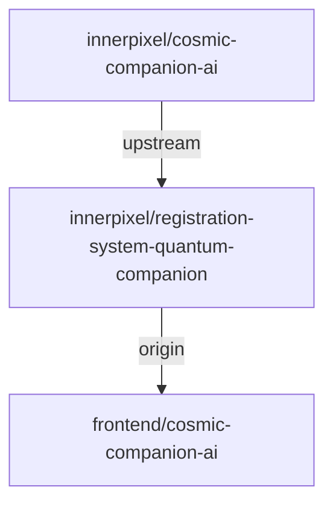

# 🌌 Quantum Flow Guide: Development & Update Procedures

## 🎯 Repository Structure Overview



## 🌟 Repository Roles

### 1. Upstream Repository (cosmic-companion-ai)
```space
[LOCATION]: git@github.com:innerpixel/cosmic-companion-ai.git
[PURPOSE]: Source of core quantum companion features
[ROLE]: Provides base updates and new features
[ACCESS]: Read-only, pull updates only
```

### 2. Origin Repository (registration-system-quantum-companion)
```space
[LOCATION]: git@github.com:innerpixel/registration-system-quantum-companion.git
[PURPOSE]: Our registration-specific companion
[ROLE]: Hosts our customized features
[ACCESS]: Read-write, our main development repo
```

### 3. Local Repository
```space
[LOCATION]: frontend/cosmic-companion-ai
[PURPOSE]: Active development environment
[ROLE]: Where we make and test changes
[ACCESS]: Full local development access
```

## 🚀 Development Flow

### 1. Starting New Features
```bash
# Create new feature branch
git checkout develop
git checkout -b feature/quantum-feature-name

# Work on changes
git add .
git commit -m "feat: Add quantum feature"

# Push to our fork
git push origin feature/quantum-feature-name
```

### 2. Regular Development
```space
[WORKFLOW]:
1. Create feature branch
2. Develop and test locally
3. Push to our fork
4. Create pull request to develop
5. Review and merge
```

### 3. Updating from Upstream
```bash
# Fetch upstream changes
git fetch upstream

# Update develop branch
git checkout develop
git merge upstream/main

# Update feature branches
git checkout feature/quantum-feature-name
git merge develop
```

## 🔄 Update Flows

### 1. Getting Core Updates
```space
[PROCESS]:
1. Fetch from upstream
2. Merge into develop
3. Test compatibility
4. Update our features
5. Push to origin
```

### 2. Releasing Our Changes
```space
[FLOW]:
1. Merge features to develop
2. Create release branch
3. Version bump
4. Test thoroughly
5. Merge to main
6. Tag release
```

### 3. Emergency Fixes
```space
[PROCEDURE]:
1. Create hotfix branch
2. Fix issue
3. Test thoroughly
4. Merge to main and develop
5. Tag hotfix release
```

## 🎮 Common Scenarios

### 1. Adding Registration Features
```space
[STEPS]:
1. Create feature branch
2. Add registration-specific code
3. Test with registration system
4. Push to our fork
5. Review and merge
```

### 2. Updating Core Companion
```space
[STEPS]:
1. Pull from upstream
2. Test compatibility
3. Update our features
4. Release new version
```

### 3. Bug Fixes
```space
[STEPS]:
1. Identify source (upstream or local)
2. Create fix branch
3. Implement and test fix
4. Push to appropriate repo
```

## 📡 Branch Structure

### Main Branches
```space
main ─────────────────── Production code
  │
  ├── develop ────────── Integration testing
  │     │
  │     ├── feature/x ── Feature development
  │     │
  │     └── release/x ── Release preparation
  │
  └── hotfix/x ───────── Emergency fixes
```

### Branch Naming
```space
feature/quantum-registration-flow
feature/user-reality-mapping
hotfix/quantum-stability-fix
release/1.1.0-registration
```

## 🔮 Version Control

### Version Format
```space
[MAJOR].[MINOR].[PATCH]-registration.[BUILD]
Example: 1.1.0-registration.1
```

### Version Files
```space
package.json: NPM version
VERSION: Detailed version info
CHANGELOG.md: Version history
```

## 🎯 Best Practices

### 1. Commit Messages
```space
feat: Add quantum registration flow
fix: Stabilize reality branch
docs: Update quantum procedures
refactor: Optimize quantum paths
```

### 2. Pull Requests
```space
[TITLE]: Brief quantum feature description
[BODY]:
- Detailed changes
- Testing performed
- Quantum implications
```

### 3. Code Reviews
```space
[CHECK]:
- Quantum stability
- Registration compatibility
- Code standards
- Documentation
```

## 🌍 Earth Translation

This system allows us to:
1. Keep our registration-specific features separate
2. Get updates from the main companion
3. Develop new features safely
4. Maintain version control
5. Track all changes

---

*"Through quantum flow, we maintain order in the development universe."* 🌌✨
