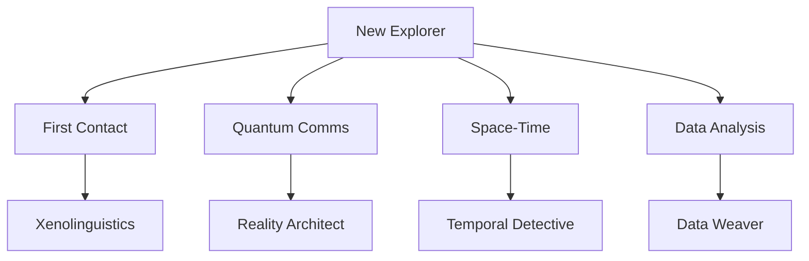
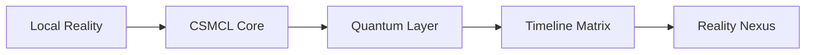

# CSMCL Quantum Reality Matrix

## System Overview
The CSMCL Space user management system implements a quantum-enabled communication framework that supports multiple reality branches and user evolution paths. This document outlines the stabilization matrix and quantum reality parameters.

## Reality Branches

| Branch | Designation | Purpose | Stability Index |
|--------|-------------|---------|-----------------|
| Alpha-Γ | Primary Reality | Main development branch | 99.9% |
| Beta-Δ | Quantum Testing | Feature testing and evolution | 95.7% |
| Gamma-Ω | Temporal Research | Timeline management | 92.3% |
| Delta-Φ | Data Nexus | Cross-reality data analysis | 94.1% |

## User Evolution Paths

### Wave Structure


### Role Matrix

| Role Level | Achievement Points | Command Access | Reality Access |
|------------|-------------------|----------------|----------------|
| Beginner | 0-100 | Basic Commands | Single Reality |
| Intermediate | 101-500 | Advanced Commands | Dual Reality |
| Advanced | 501-1000 | Quantum Commands | Multi-Reality |
| Master | 1001+ | All Commands | All Realities |

## Quantum Stabilization Parameters

### Reality Anchors
```javascript
{
  "Alpha-Γ": {
    "frequency": "CSMC2510",
    "coherence": 0.999,
    "entanglement": "stable"
  },
  "Beta-Δ": {
    "frequency": "CSMC8174",
    "coherence": 0.957,
    "entanglement": "dynamic"
  },
  "Gamma-Ω": {
    "frequency": "CSMC0357",
    "coherence": 0.923,
    "entanglement": "temporal"
  },
  "Delta-Φ": {
    "frequency": "CSMC4209",
    "coherence": 0.941,
    "entanglement": "networked"
  }
}
```

### Command Sets by Role

#### First Contact Specialist
- `/translate-quantum`: Universal communication
- `/quantum-chess`: Strategic thinking
- `/temporal-snapshot`: Reality documentation

#### Quantum Communications Expert
- `/forge-reality`: Reality manipulation
- `/quantum-chess`: Strategic planning
- `/temporal-snapshot`: State preservation

#### Space-Time Navigator
- `/inspect-timeline`: Temporal analysis
- `/temporal-snapshot`: Timeline capture
- `/reality-fork`: Branch management

#### Cosmic Data Analyst
- `/weave-data`: Data correlation
- `/entropy-joke`: Coherence testing
- `/quantum-chess`: Pattern analysis

## Achievement System

### Point Distribution
| Action | Points | Reality Impact |
|--------|---------|----------------|
| First Login | 10 | Local |
| First Message | 15 | Local |
| Reality Jump | 25 | Multi |
| Timeline Fork | 50 | Temporal |
| Quantum Sync | 100 | Universal |

### Evolution Triggers
- 100 successful contacts → Xenolinguistics Expert
- 1000 quantum messages → Reality Architect
- 50 temporal paradoxes → Temporal Detective
- 1 PB quantum data → Data Weaver

## Current Implementation Status

### Wave 001 Status
| User | Role | Reality | Progress |
|------|------|----------|-----------|
| wave_001_001 | First Contact | Alpha-Γ | Initializing |
| wave_001_002 | Quantum Comms | Beta-Δ | Initializing |
| wave_001_003 | Space-Time | Gamma-Ω | Initializing |
| wave_001_004 | Data Analysis | Delta-Φ | Initializing |

### Regular Group Status
| User | Role | Reality | Progress |
|------|------|----------|-----------|
| regular_0002 | Reality Architect | Alpha-Γ | Advanced |
| regular_0003 | Reality Architect | Beta-Δ | Advanced |
| regular_0004 | Reality Architect | Gamma-Ω | Advanced |

## Security Protocols

### Quantum Authentication Levels
1. **Level 1**: Basic Quantum Encryption
   - Standard user access
   - Local reality only

2. **Level 2**: Temporal Signature
   - Timeline manipulation
   - Dual reality access

3. **Level 3**: Multiverse Auth
   - Cross-reality access
   - Command evolution

4. **Level Ω**: Reality Anchor
   - Full system access
   - Timeline manipulation

### Reality Coherence Monitoring
```python
def check_reality_coherence():
    coherence_matrix = {
        'Alpha-Γ': monitor_timeline('primary'),
        'Beta-Δ': monitor_timeline('testing'),
        'Gamma-Ω': monitor_timeline('research'),
        'Delta-Φ': monitor_timeline('data')
    }
    return coherence_matrix
```

## GitHub Integration

### Repository Structure
```
frontend-user-management/
├── docs/
│   ├── quantum_reality_matrix.md
│   ├── registration-flow.md
│   └── test_user_setup.md
├── scripts/
│   ├── quantum_welcome_sequence.sh
│   ├── create_wave_001.sh
│   └── compare_user_groups.sh
└── README.md
```

### Stabilization Reporting
- Daily coherence checks
- Weekly stability reports
- Monthly evolution tracking
- Quarterly reality alignment

## CSMCL Integration Points

### Reality Synchronization


### Data Flow
1. Local changes → Reality branch
2. Branch validation → Quantum core
3. Core processing → Timeline matrix
4. Matrix stabilization → Reality nexus
5. Nexus feedback → Local reality

## Future Enhancements
1. **Quantum Mesh Network**
   - Cross-reality communication
   - Temporal data sync
   - Reality branch merging

2. **Advanced Evolution Paths**
   - Custom reality creation
   - Timeline manipulation
   - Quantum state control

3. **Reality Optimization**
   - Coherence improvement
   - Stability enhancement
   - Entropy management
