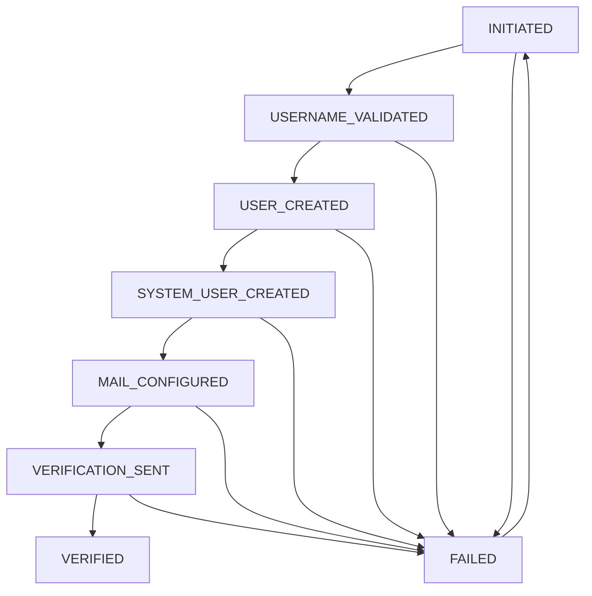

# Cosmic User Registration System Flow

## User Data Structure

### Registration Input Fields
1. **Personal Contact Email**
   - Purpose: Verification and emergency contact
   - Example: `user.personal@hotmail.com`
   - Requirements:
     - Must be valid email format
     - Must be unique in system
     - Used for sending verification link

2. **Cosmical Display Name**
   - Purpose: Public identifier/designation
   - Example: `Cosmic Explorer Alpha`
   - Requirements:
     - Minimum 3 characters
     - Can contain spaces and special characters
     - Must be unique

3. **System Username**
   - Purpose: Linux system account and email prefix
   - Example: `explorer_alpha`
   - Requirements:
     - Must follow Linux username conventions
     - 3-16 characters
     - Lowercase letters, numbers, underscore, hyphen
     - Must start with a letter
     - Must be unique
     - Will form system email: `username@local.domain`

4. **Password**
   - Purpose: System authentication
   - Requirements:
     - Minimum 8 characters
     - Must contain mix of characters
     - Stored with bcrypt hashing

5. **Phone Number**
   - Purpose: Future emergency protocols
   - Example: `+1234567890`
   - Requirements:
     - International format (e.g., +1234567890)
     - Pattern: ^\+[0-9]{1,15}$
     - Must be unique
     - No verification required at this stage

## Validation Process

```javascript
async function validateRegistration(data) {
    // 1. Username Validations
    const systemUserExists = await checkSystemUser(data.username);
    const emailExists = await checkEmail(`${data.username}@local.domain`);
    const isValidUsername = /^[a-z][a-z0-9_-]{2,15}$/.test(data.username);

    // 2. Personal Email Validation
    const personalEmailExists = await checkPersonalEmail(data.personalEmail);
    const isValidEmail = /^[^\s@]+@[^\s@]+\.[^\s@]+$/.test(data.personalEmail);

    // 3. Display Name Validation
    const displayNameExists = await checkDisplayName(data.displayName);
    const isValidDisplayName = data.displayName.length >= 3;

    // 4. Phone Number Validation
    const phoneNumberExists = await checkPhoneNumber(data.phoneNumber);
    const isValidPhoneNumber = /^\+[0-9]{1,15}$/.test(data.phoneNumber);

    // All validations must pass
    return {
        isValid: !systemUserExists && 
                !emailExists && 
                !personalEmailExists && 
                !displayNameExists &&
                !phoneNumberExists &&
                isValidUsername &&
                isValidEmail &&
                isValidDisplayName &&
                isValidPhoneNumber,
        errors: {
            username: systemUserExists ? 'Username already taken' : null,
            email: emailExists ? 'Email already registered' : null,
            personalEmail: personalEmailExists ? 'Personal email already registered' : null,
            displayName: displayNameExists ? 'Display name already taken' : null,
            phoneNumber: phoneNumberExists ? 'Phone number already assigned' : null
        }
    };
}
```

## Database Schema

```javascript
const UserSchema = {
    // System Identifiers
    username: {
        type: String,
        required: true,
        unique: true,
        lowercase: true,
        match: /^[a-z][a-z0-9_-]{2,15}$/
    },
    
    // Public Profile
    displayName: {
        type: String,
        required: true,
        unique: true,
        minLength: 3
    },
    
    // Email Addresses
    systemEmail: {
        type: String,
        required: true,
        unique: true,
        // Generated from username@local.domain
    },
    personalEmail: {
        type: String,
        required: true,
        unique: true,
        // Their external contact email
    },
    
    // Authentication
    password: {
        type: String,
        required: true
        // Stored with bcrypt
    },
    
    // Emergency Info
    phoneNumber: {
        type: String,
        required: true,
        unique: true,
        match: /^\+[0-9]{1,15}$/
    },
    
    // Status Flags
    isVerified: {
        type: Boolean,
        default: false
    },
    systemUserCreated: {
        type: Boolean,
        default: false
    },
    
    // Timestamps
    createdAt: {
        type: Date,
        default: Date.now
    },
    verifiedAt: Date,
    lastLoginAt: Date
}
```

## Registration Flow

### Overview
The registration process is designed to be secure and reliable, with proper validation at each step and clear error handling. The process includes username validation, system user creation, email verification, and status tracking.

### Registration States

The registration process follows a strict state machine pattern:

### States

1. `INITIATED`
   - Initial state when form is submitted
   - Basic validation starts
   - Form data collected

2. `USERNAME_VALIDATED`
   - Username format validated
   - Username availability confirmed
   - Email and phone number uniqueness verified

3. `USER_CREATED`
   - Auth user record created
   - Temporary token generated
   - Basic profile established

4. `SYSTEM_USER_CREATED`
   - Linux system user created
   - System email account prepared
   - Base directories created

5. `MAIL_CONFIGURED`
   - Mail directories configured
   - System email setup completed
   - Mail forwarding rules established

6. `VERIFICATION_SENT`
   - Verification email sent to personal email
   - Token generated and stored
   - User notified to check email

7. `VERIFIED`
   - Email verification completed
   - System setup finalized
   - User can now access system

8. `FAILED`
   - Error state for any step
   - Contains error details
   - Allows retry from last successful state

### State Transitions



### Error Handling

Each state transition includes comprehensive error handling:

1. **Validation Errors**
   - Username format/availability
   - Email format/uniqueness
   - Phone number format/uniqueness
   - Password requirements

2. **System Setup Errors**
   - User creation failures
   - Mail configuration issues
   - Directory setup problems
   - Permission errors

3. **Verification Errors**
   - Email sending failures
   - Invalid/expired tokens
   - System completion errors

### Recovery Procedures

The system supports recovery from failures:

1. **Automatic Retry**
   - Tracks last successful state
   - Can resume from last good state
   - Preserves user data

2. **Manual Intervention**
   - Admin interface for stuck registrations
   - Tools for system cleanup
   - User notification system

### Validation Rules

#### Username
- Must start with a lowercase letter
- Can contain lowercase letters, numbers, underscores, and hyphens
- Length: 3-15 characters
- Pattern: ^[a-z][a-z0-9_-]{2,15}$
- Must be unique

#### Display Name
- Minimum length: 3 characters
- Must be unique
- Can contain any printable characters

#### Personal Email
- Must be a valid email format
- Must be unique
- Used for account verification

#### Password
- Minimum length: 8 characters
- No maximum length enforced
- Hashed using bcrypt (10 rounds)

#### Phone Number
- International format (e.g., +1234567890)
- Pattern: ^\+[0-9]{1,15}$
- Must be unique
- No verification required at this stage

### Error Handling

#### Registration Failures
1. **Validation Errors**
   - Returns 400 Bad Request
   - Lists all validation errors
   - No database changes made

2. **Duplicate Fields**
   - Returns 409 Conflict
   - Specifies which field is duplicate
   - Suggests alternative usernames

3. **System User Creation Failure**
   - Rolls back user creation
   - Logs error details
   - Returns 500 with retry information

4. **Email Service Failures**
   - Keeps user record
   - Allows resending verification
   - Logs email service errors

### Recovery Procedures

1. **Failed at USER_CREATED**
   - Admin can manually delete user record
   - User can retry with different credentials

2. **Failed at SYSTEM_USER_CREATED**
   - Admin can retry system user creation
   - Admin can clean up partial system user

3. **Failed at VERIFICATION_SENT**
   - User can request new verification email
   - Admin can manually verify email

### Security Measures

1. **Rate Limiting**
   - Max 5 registration attempts per IP per hour
   - Max 3 verification email requests per user per day

2. **Token Security**
   - Verification tokens expire after 24 hours
   - One-time use only
   - Invalidated on password change

3. **Data Protection**
   - Passwords hashed before storage
   - Personal data encrypted at rest
   - System email generated internally

### Monitoring

#### Key Metrics
1. **Success Rate**
   - Registration completion rate
   - Average time to complete
   - Failure points distribution

2. **Performance**
   - Response times per step
   - Database operation times
   - Email delivery rates

3. **Security**
   - Failed attempt patterns
   - IP-based activity
   - Token usage statistics

#### Logging
All registration steps are logged with:
- Timestamp
- Request ID
- IP Address
- Username
- Status change
- Error details (if any)

### Testing

#### Integration Tests
1. **Happy Path**
   - Complete registration flow
   - Email verification
   - First login

2. **Error Cases**
   - Duplicate usernames
   - Invalid inputs
   - Service failures

3. **Security**
   - Token tampering
   - Rate limiting
   - Input sanitization

### Support Procedures

#### Common Issues

1. **Verification Email Not Received**
   ```bash
   # Check email logs
   tail -f /var/www/preprod.local/auth/logs/email.log
   
   # Resend verification email
   curl -X POST https://auth.preprod.local/api/auth/resend-verification \
     -H "Content-Type: application/json" \
     -d '{"username": "user123"}'
   ```

2. **System User Creation Failed**
   ```bash
   # Check system integration logs
   tail -f /var/www/preprod.local/auth/logs/system.log
   
   # Retry system user creation
   curl -X POST https://auth.preprod.local/api/auth/retry-system-user \
     -H "Authorization: Bearer <admin_token>" \
     -d '{"username": "user123"}'
   ```

#### Admin Tools
1. **Status Check**
   ```bash
   # Get detailed registration status
   curl https://auth.preprod.local/api/auth/status/registration/user123
   ```

2. **Manual Verification**
   ```bash
   # Verify email manually (admin only)
   curl -X POST https://auth.preprod.local/api/auth/admin/verify-email \
     -H "Authorization: Bearer <admin_token>" \
     -d '{"username": "user123"}'
   ```

### Cleanup Procedures

#### Failed Registrations
1. Remove user record if exists
2. Clean up system user if created
3. Remove email verification tokens
4. Clear any cached data

#### Automated Cleanup
- Failed registrations older than 24 hours
- Expired verification tokens
- Unused system users

### Contact Information

#### Technical Support
- Email: support@preprod.local
- Internal: ext. 5555

#### Emergency Contacts
- System Admin: admin@preprod.local
- Security Team: security@preprod.local

## Backend Registration Process

```javascript
async function registerUser(data) {
    // Start transaction
    const session = await mongoose.startSession();
    session.startTransaction();
    
    try {
        // 1. Validate all inputs
        const validation = await validateRegistration(data);
        if (!validation.isValid) {
            throw new ValidationError(validation.errors);
        }
        
        // 2. Create user in MongoDB
        const user = await User.create({
            username: data.username,
            displayName: data.displayName,
            systemEmail: `${data.username}@local.domain`,
            personalEmail: data.personalEmail,
            password: await bcrypt.hash(data.password, 10),
            phoneNumber: data.phoneNumber
        });
        
        // 3. Create Linux system user
        await createSystemUser({
            username: data.username,
            email: `${data.username}@local.domain`
        });
        
        // 4. Update user record
        user.systemUserCreated = true;
        await user.save();
        
        // 5. Generate verification token
        const verificationToken = generateToken(user);
        
        // 6. Send verification email
        await sendVerificationEmail({
            to: data.personalEmail,
            token: verificationToken,
            username: data.username,
            displayName: data.displayName
        });
        
        // Commit transaction
        await session.commitTransaction();
        
        return {
            success: true,
            user: {
                username: user.username,
                displayName: user.displayName,
                systemEmail: user.systemEmail
            }
        };
        
    } catch (error) {
        // Rollback on any error
        await session.abortTransaction();
        
        // Clean up system user if created
        if (error.systemUserCreated) {
            await removeSystemUser(data.username);
        }
        
        throw error;
    }
}
```

## Email Verification Process

```javascript
async function verifyEmail(token) {
    // 1. Validate token
    const decoded = jwt.verify(token, process.env.JWT_SECRET);
    
    // 2. Update user verification status
    const user = await User.findByIdAndUpdate(
        decoded.userId,
        {
            isVerified: true,
            verifiedAt: new Date()
        },
        { new: true }
    );
    
    // 3. Send welcome email
    await sendWelcomeEmail({
        to: user.systemEmail,
        displayName: user.displayName
    });
    
    return user;
}
```

## Error Handling

### Validation Errors
- Invalid username format
- Duplicate entries
- Invalid email format
- Weak password

### System Errors
- Linux user creation failure
- Email sending failure
- Database transaction failure

### Recovery Procedures
- Transaction rollback
- System user cleanup
- Error logging
- User notification

## Security Considerations

### Password Security
- Bcrypt hashing
- Minimum strength requirements
- No plaintext storage

### Email Security
- Verification required
- Secure token generation
- Limited token validity

### System Security
- Proper Linux permissions
- Secure mail directory setup
- Protected user home directories
